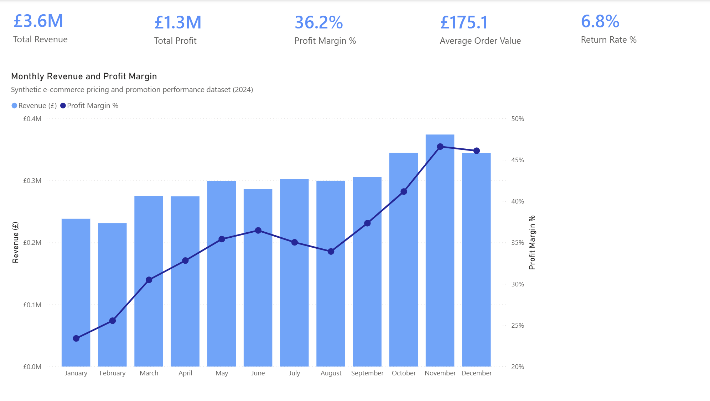
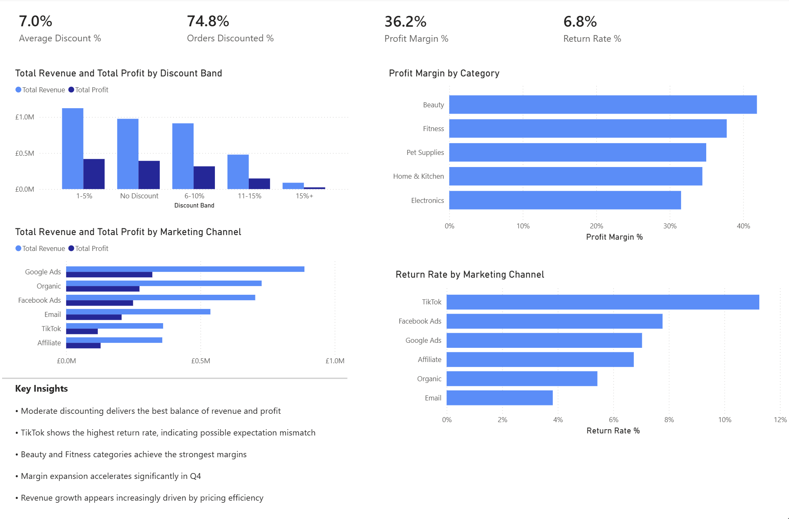
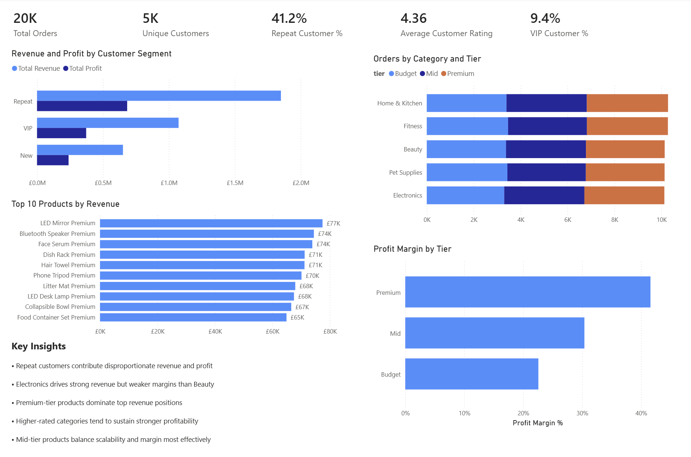

# E-commerce Pricing & Promotion Performance Dashboard

A multi-page Power BI dashboard and Python-generated synthetic dataset designed to analyse pricing strategy, discount performance, customer behaviour, product profitability, and marketing channel effectiveness within a simulated e-commerce business environment.

The project combines Python data generation and transformation with Power BI dashboard development to create a commercially realistic business intelligence case study.

---

# Project Overview

This project was built to answer key commercial questions including:

- How do discounts impact revenue and profitability?
- Which customer segments drive the most value?
- Which product tiers generate the strongest margins?
- Which marketing channels produce the best performance?
- How concentrated is revenue across products and customer groups?
- How do pricing and promotion strategies affect operational outcomes?

The dataset was generated programmatically in Python to simulate realistic e-commerce behaviour, pricing structures, customer segmentation, seasonality, and profitability dynamics.

---

# Tools & Skills Demonstrated

## Python
- Pandas
- NumPy
- Synthetic data generation
- Data transformation
- KPI engineering
- Export workflows

## Power BI
- DAX measures
- KPI cards
- Interactive dashboards
- Data visualisation
- Business storytelling
- Executive dashboard design

## Analytical Areas
- Pricing analysis
- Discount optimisation
- Profitability analysis
- Customer segmentation
- Product performance
- Marketing channel analysis
- Margin analysis

---

# Dataset Summary

The synthetic dataset contains:

- ~50,000 order-level records
- 5 product categories
- 3 customer segments
- Multiple marketing channels
- Tiered pricing structures
- Simulated discounts and return rates
- Revenue, cost, profit, and margin calculations
- Seasonality and profitability variation across the year

---

# Dashboard Pages

## Page 1 — Executive Overview

High-level business KPIs and monthly performance trends.

### Key Metrics
- Total Revenue
- Total Profit
- Profit Margin %
- Average Order Value
- Return Rate %

### Focus Areas
- Revenue growth trends
- Margin expansion over time
- Executive performance summary



---

## Page 2 — Pricing & Promotion Analysis

Analysis of discount strategy, profitability, and marketing performance.

### Focus Areas
- Revenue and profit by discount band
- Profit margin by category
- Revenue and profit by marketing channel
- Discount effectiveness
- Return behaviour analysis

### Key Insights
- Moderate discounting delivers the strongest balance of revenue and profit
- Premium positioning supports significantly stronger margins
- Certain marketing channels generate elevated return rates
- Margin expansion accelerates during Q4



---

## Page 3 — Customer & Product Performance

Customer segmentation and product-level profitability analysis.

### Focus Areas
- Revenue and profit by customer segment
- Orders by category and product tier
- Top-performing products
- Profit margin by tier
- Revenue concentration analysis

### Key Insights
- Repeat customers contribute disproportionate revenue and profit
- Electronics drives strong revenue but weaker margins than Beauty
- Premium-tier products dominate top revenue positions
- Mid-tier products balance scalability and profitability effectively



---

# Files Included

| File | Description |
|---|---|
| `ecommerce_pricing_promotion_dashboard.pbix` | Full Power BI dashboard |
| `ecommerce_orders_realistic.csv` | Synthetic e-commerce dataset |
| `pricing_promotion_dataset_generation.ipynb` | Python notebook used to generate and engineer the dataset |

---

# Project Structure

```text
ecommerce-pricing-promotion-dashboard/
│
├── data/
│   └── ecommerce_orders_realistic.csv
│
├── images/
│   ├── page1-executive-summary.png
│   ├── page2-pricing-promotion.png
│   └── page3-customer-product-analysis.png
│
├── notebooks/
│   └── pricing_promotion_dataset_generation.ipynb
│
├── ecommerce_pricing_promotion_dashboard.pbix
├── README.md
